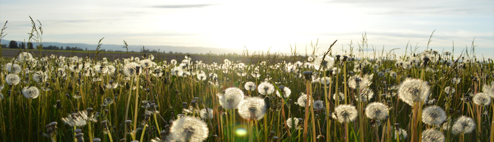
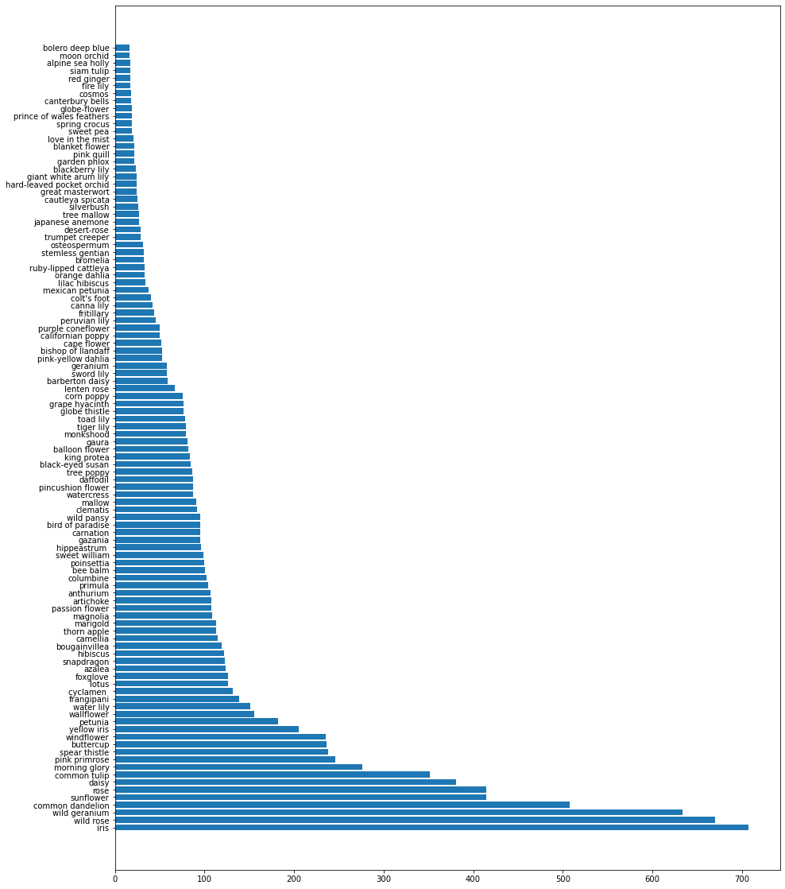

# Introduction

In this journal, a machine learning model is used to identify flowers through image classification. This multi-classification model is trained with thousands of images which are randomly augmented to achieve better generalization. The model serves to be a proof of concept in battling invasive plant species that damage the fragile ecosystems in which they reside. This journal will contain the steps taken to arrive at a similar model. Analysis of the results will be mentioned in the later sections, followed by what the results mean for the stakeholder.

# Business Understanding

Every year, the U.S. is estimated to lose $120B due to the impact of invasive plant species. Invasive plant species can reduce yield in nearby agriculture, kill existing plants, increase the risk of forest fires, and much more. While the spread of invasive plant species can be slowed through customs, the plants that reside in U.S. right now need to be found and removed. Programs to remove these plants are already in place, but can be accelerated through the use of machine learning and scouting tools like drones. Drones can quickly scout dangerous terrain and machine learning can rapidly review photos to identify an invasive plant species. This proposal will help reduce cost spent in manual labor and remove the risk of workers traversing dangerous terrain.

# Data Understanding

There are 104 different flower species provided in this dataset, 16,463 images with different compositions. An image can be of a distant rose bush, a macro photo of a sunflower bud, or a portrait with a hibiscus tucked behind the ear. The distribution of these flowers is not equal and would result in some preprocessing before models should be trained.

# Data Preparation

The structure of the directory has class labels for the train and validation folder, but the test folder contains images without any labels. To create a typical train, validate, and test structure, the images in the test folder will be ignored from this point on. 10% of the images found in the train folder will be moved into a new test folder, resulting in three folders with labeled images.

With this directory set up, classes of flowers that do not have enough information on which to train a model can be removed. Functions have been created to select these folders to avoid manually separating the folders by hand. In the models shown in the notebook, the 10th percentile of the number of images found in the training are removed from the scope. This leaves 96 classes with 16,268 images. On average, there should be 168 images per class that can be divided into train, validation, and test sets. 

With nearly 100 different classes, there are not enough images to effectively train a model. Data augmentation will be used to make the model more generalizable. Each image will randomly flip, change in brightness, crop, and many other transformations. Also, with these images being RGB, the images will need to be standardized from 0 and 255 to the range of 0 and 1.

# Modeling

Through many iterations, the final model comes out to be a convolutional neural network (CNN) with several layers. The model looks through each image and run for 20 epochs. There is also a learning rate that reduces the rate at which the model trains. The goal of the learning rate is to prevent training loss to get ahead of the validation loss.

There were some attempts at bettering the model during training but metrics were not improved. The final model faced much overfitting issues but did not use BatchNormalization nor Dropout layers. Adding these layers did not help improve the cross-validation accuracy metric. When attempting to introduce transfer learning, the results instead reduced the cross-validation accuracy metric and increased validation loss. With shorter run times and better metrics, these layers were removed from the final model.

# Analysis

With the model fully trained, the best accuracy of the model was 31% cross-validation accuracy. The same model is evaluated against the test set and performed at 28% test accuracy. The result is a model that can make classifications better than random guess, which would be 1/96. This is a significant improvement over random guess as random guessing would be correct ~1% of the time. 

The model could be improved by having more images of flowers to train on. More images means the model could identify just the important features. Also, perhaps the model could improve if more resources were available, like RAM or GPU. 

# Conclusion

Image classification of flowers is possible with what was gathered for the model. 31% of the images looked at by this model are correctly identified. While the model could be improved, this is a proof of concept for the U.S. Department of Agriculture. The model has much room for improvement given more time and resources, but for the scope of the project, a model has been trained on images to identify the species of a flower.

### Nagivation

